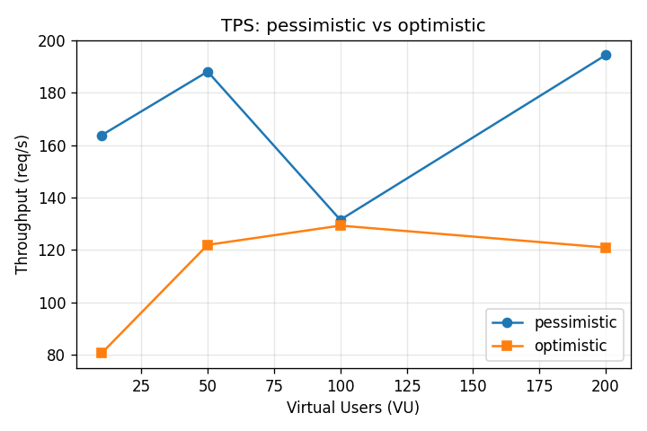
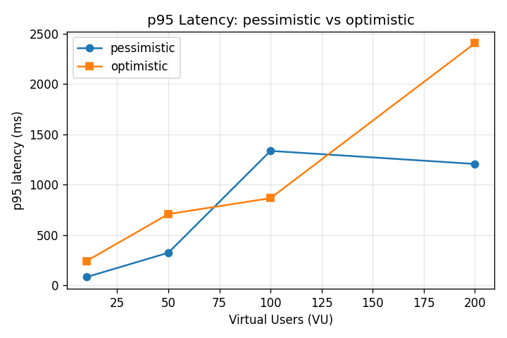
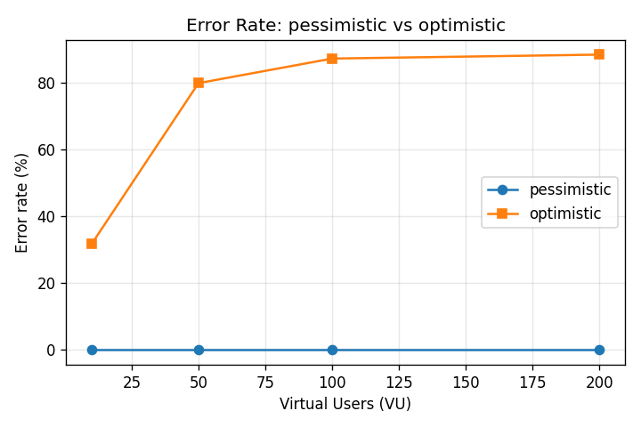
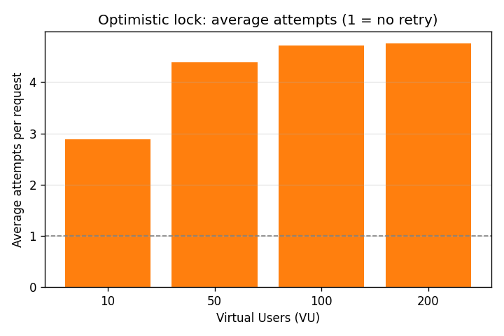

# 부하 테스트: 비관적 락 vs 낙관적 락 실측 (S8)

[docs/optimistic-vs-pessimistic-lock.md](optimistic-vs-pessimistic-lock.md)에서 분석만 했던 트레이드오프를, 같은 지갑에 동시 결제를 퍼부어서 실측으로 증명한다.

> **주의**: 아래 수치는 이 머신·이 시점의 측정값이다. 로컬 머신 사양, MySQL/JVM 설정, 백그라운드 프로세스에 따라 절대값은 달라질 수 있다. **여기서 봐야 할 건 절대 수치가 아니라 두 방식 사이의 상대적인 경향**(에러율이 갈라지는 모양, TPS가 VU에 반응하는 방향)이다.

## 측정 환경

| 항목 | 값 |
|---|---|
| OS | Windows 10 Pro 10.0.19045 |
| CPU | Intel64 Family 6 Model 165, 논리 코어 16개 |
| Docker Desktop 리소스 할당 | 16 vCPU / 15.6GB (MySQL·RabbitMQ·k6가 이 안에서 실행됨) |
| Java | Temurin 17.0.19 |
| Spring Boot | 3.5.15 |
| MySQL | 8.0.46 (Docker, `docker-compose.yml`) |
| RabbitMQ | 3.13.7 (Docker) |
| HikariCP 풀 크기 | **50** (기본값 10에서 늘림 — 아래 "왜 풀 크기를 늘렸나" 참고) |
| k6 | v2.0.0 (Docker, `grafana/k6`) |
| 앱 실행 방식 | `java -jar` 직접 실행(JVM, gradle 데몬 분리), `--spring.profiles.active=local,benchmark` |
| 부하 시나리오 | 지갑 1개(잠금 방식별로 별도 지갑) + 가맹점 1개, 결제 금액 1원, Idempotency-Key는 매 요청 고유값 |
| 측정 패턴 | VU별로 5초 램프업 + 20초 유지, 4단계(VU 10/50/100/200) × 2방식 = 8회 |

### 왜 풀 크기를 늘렸나

Spring Boot 기본 HikariCP 풀은 10이다. VU를 200까지 올리면, 풀이 작을 경우 측정되는 지연이 "DB 행 잠금 경합"이 아니라 "HTTP 스레드가 커넥션 하나를 기다리는 줄"을 반영하게 된다. 두 락 전략의 차이를 보려고 하는 실험인데 풀 크기라는 별개의 병목이 섞이면 결과를 해석할 수 없다. 그래서 50으로 늘려서, 더 많은 요청이 동시에 DB까지 도달해 실제 행 잠금(비관적) 또는 버전 충돌(낙관적)을 겪도록 했다. (`application-benchmark.yml`)

### 재현 방법

```bash
docker compose up -d
./gradlew bootJar
java -jar build/libs/wallet-payment-0.0.1-SNAPSHOT.jar --spring.profiles.active=local,benchmark &

bash benchmark/scripts/setup.sh        # 지갑 2개 + 가맹점 1개 생성, 1억원씩 충전
bash benchmark/scripts/run-all.sh      # 8회 k6 실행 + 매 회 잔액==원장합계 검증
python3 benchmark/scripts/parse_results.py   # results.csv + chart_*.png 생성
```

## 결과

| 락 방식 | VU | 처리량(TPS) | p50(ms) | p95(ms) | p99(ms) | 에러율 | 평균 시도횟수 | 잔액==원장 |
|---|---|---|---|---|---|---|---|---|
| 비관적 | 10  | 163.7 | 53.8  | 83.0   | 111.4  | 0.0%  | – | ✅ |
| 비관적 | 50  | 188.0 | 240.7 | 324.4  | 403.1  | 0.0%  | – | ✅ |
| 비관적 | 100 | 131.5 | 511.5 | 1336.6 | 2397.4 | 0.0%  | – | ✅ |
| 비관적 | 200 | 194.3 | 943.7 | 1206.6 | 1227.3 | 0.0%  | – | ✅ |
| 낙관적 | 10  | 80.5  | 78.2  | 242.2  | 295.1  | 31.7% | 2.88 | ✅ |
| 낙관적 | 50  | 121.9 | 371.7 | 708.5  | 963.3  | 79.9% | 4.39 | ✅ |
| 낙관적 | 100 | 129.3 | 739.8 | 866.9  | 1726.3 | 87.3% | 4.71 | ✅ |
| 낙관적 | 200 | 120.9 | 1529.0| 2405.8 | 2473.3 | 88.5% | 4.75 | ✅ |

원본 데이터: [benchmark/results/results.csv](../benchmark/results/results.csv), k6 원시 요약: `benchmark/results/*.json`, 검증 로그: `benchmark/results/*.verify.txt`.

평균 시도횟수의 재시도 정책: 최대 5회, 충돌마다 `10ms × 시도번호`의 선형 백오프(`OptimisticPaymentService`). VU 200에서 평균 4.75회면 거의 매 요청이 한도(5회)를 다 쓰고도 절반 가까이는 결국 실패한다는 뜻이다.

### 그래프






### 잔액 정합성

8번의 실행 모두 직후에 `balance == LedgerEntry 합계`를 직접 SQL로 검증했다(`benchmark/scripts/verify.sh`). 88%가 실패하는 극단적 경합 상황에서도 한 번도 어긋나지 않았다 — 실패한 시도는 트랜잭션이 통째로 롤백되어 잔액에 어떤 흔적도 남기지 않기 때문이다(ADR-005와 같은 원리).

## 해석

**경합이 약할 때(VU=10)**: 둘 다 쓸 만하다. 비관적 락이 이미 더 빠르고(TPS 163 vs 81) 에러도 0%지만, 낙관적 락도 에러율 31.7%로 시작한다 — 단일 지갑에 10개 VU를 동시에 퍼붓는 것 자체가 이미 "경합이 약하다"고 보기 어려운 수준이라는 뜻이다. 더 약한 경합(여러 지갑에 분산, 또는 VU 2~3)에서는 낙관적 락이 거의 충돌 없이 비관적 락과 비슷하거나 더 가벼울 가능성이 높다(잠금 비용이 없으므로).

**경합이 심할 때(VU=50 이상)**: 격차가 뚜렷하다. 비관적 락의 TPS는 등락은 있지만 에러율 0%를 유지한다 — 대기는 늘어도 헛수고가 없다. 낙관적 락은 에러율이 80%대 후반까지 치솟고, 평균 시도횟수가 거의 5(상한)에 붙는다 — 재시도가 재시도를 부르는 상황이다: 동시에 읽은 VU들이 우르르 충돌 → 일부만 성공 → 나머지는 다시 읽고 또 우르르 충돌. 단일 지갑처럼 "거의 모든 요청이 같은 row를 두드리는" 워크로드에는 낙관적 락의 재시도 전제(=대부분 충돌 없이 한 번에 끝난다)가 깨진다.

**왜 그런가**: 비관적 락은 동시성을 "직렬화"로 바꾼다 — N개가 몰려도 줄을 서서 한 번에 하나씩 처리되니, 처리는 늦어져도 실패하지 않는다. 낙관적 락은 동시성을 "전부 시도해보고 진 사람은 다시"로 처리하는데, 경쟁자가 많을수록 "다시 시도"하는 사람도 많아지고, 그 사람들이 또 동시에 부딫혀서 또 진다 — 경쟁자 수가 늘어날수록 헛수고의 비율이 기하급수적으로 늘어나는 구조다. 같은 지갑(혹은 소수의 지갑)에 집중된 부하라는 이 실험의 시나리오 자체가 낙관적 락에 가장 불리한 조건이라는 점은 감안해야 한다 — 결제가 보통 한 명의 지갑에서만 발생한다는 현실(다대다 경합이 아니라 일부 "핫" 지갑에만 몰리는 경합)을 생각하면, 이 결과는 오히려 실제 운영 환경과 가깝다.

**결론**: 이 실험은 CLAUDE.md가 기본값으로 정한 비관적 락의 선택을 데이터로 뒷받침한다. 결제처럼 동일 자원(지갑)에 경합이 몰릴 수 있는 도메인에서는, "대기는 늘어도 절대 헛수고하지 않는" 비관적 락이 "빠를 때는 가볍지만 경합이 심해지면 무너지는" 낙관적 락보다 안정적이다.
